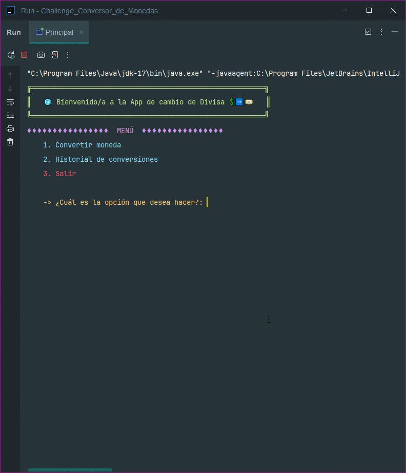
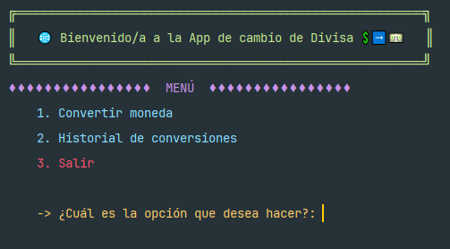
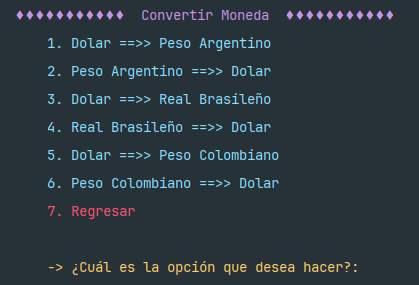
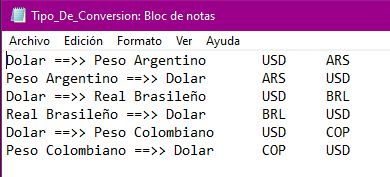
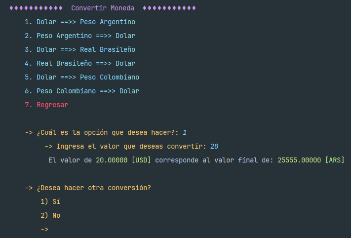
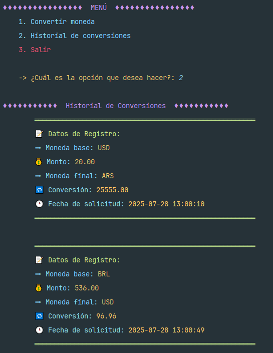
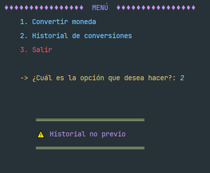
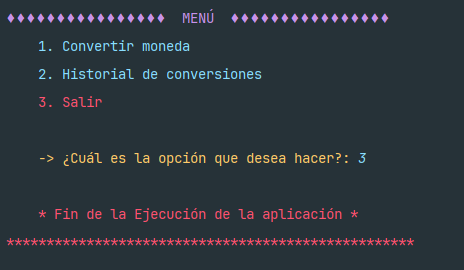
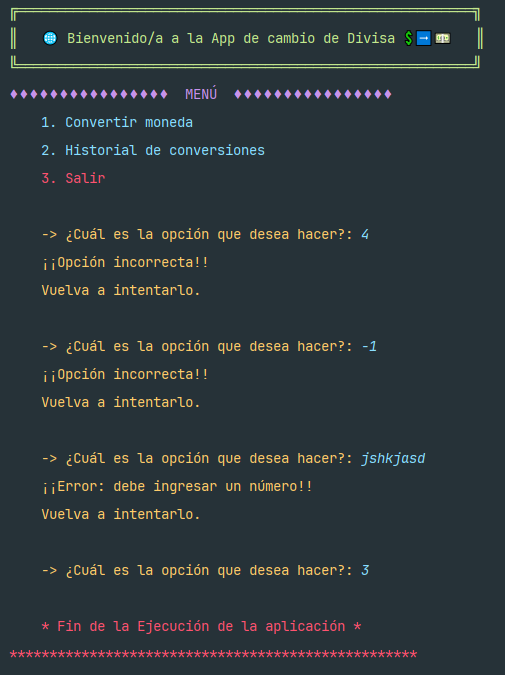

 

  

![Alura]
  <h1>Challenge: Conversor de Monedas 💲➡💵</h1>
  

    🤯Un increíble proyecto donde podrás hacer diferentes conversiones de divisas, solicitando
    las tazas de conversion actualizadas en tiempo real.🔄🕒

  

---

Indice

- [🤔Acerca del proyecto](#acerca-del-proyecto)
- [👷‍♂️Construido con:](#️construido-con)
- [🛠Cómo empezar.](#cómo-empezar)
  - [📜Requisitos](#requisitos)
  - [🔢 Pasos](#-pasos)
- [🛶Funcionamiento](#funcionamiento)
  - [✅ Menu principal](#-menu-principal)
    - [🔀 Convertir moneda](#-convertir-moneda)
    - [🔙 Historial de conversiones](#-historial-de-conversiones)
    - [❌ Salir](#-salir)
  - [🚓Excepciones y contramedidas](#excepciones-y-contramedidas)
- [Roadmap](#roadmap)

---

## 🤔Acerca del proyecto

Este interesante proyecto, haremos uso de los conocimientos aprendidos en el curso
**Java Orientación a Objetos** impartido por **ALURA Latam - ONE** (Oracle Next Education).

Este proyecto hará uso de:

- Listas
- Programacion Orientada a Objetos POO
- Lectura y Escritura de archivos de texto y JSON
- Peticiones a una API
- Uso de excepciones

Con lo que creamos una aplicación para la converion de divisas, mediante el ingreso del
monto a convertir a su equivalencia en otra divisa, con la ayuda de la
API [ExchangeRate-API](https://www.exchangerate-api.com/img/hr-logo-2022-ldpi-rc.png)
para obtener las tasas de cambio actualizadas.

Otras funcionalidades que ofrece la aplicacion son:

- Agregar los tipos de conversion
- Poder hacer diferentes tipos de conversion
- Manejo de errores
- Uso de un menu amigable
- Consuta del historial de converiones hechas.

---

## 👷‍♂️Construido con:

Su construcción fue mediante las siguientes herramientas:

![Java]
![IntelliJ IDEA]
![Git]
![GitHub]

## 🛠Cómo empezar.

### 📜Requisitos

- Tener instalado Java JDK 17.0.6.
- OPCIONAL: Un IDE que ejecute Java (IntelliJIDEA, NeatBeans)
- Conexión a internet para consultar la API.

### 🔢 Pasos

1. Descargar o clonar este repositorio.

   `https://github.com/RubenD-hub/Challenge-Conversor-de-Moneda.git`

2. Abrir el repositorio con el IDE preferido.
3. Compilar y ejecutar el proyecto.

## 🛶Funcionamiento

En el siguiente GIF podemos ver el funcionamiento principal de la apliccaion.

### ✅ Menu principal

Al ejecutar la aplicacion, lo primero que podemos encontrar es un menu principal con 3 opciones.

#### 🔀 Convertir moneda

La primera opcion nos permitira hacer una serie de conversiones disponibles, que se mostraran en un submenu.

> [!NOTE]
> Si se requiere agregar otro tipo de conversion, se tiene que agregar de manera 
manual en el archivo `Tipo_De_Conversion.txt`, respetando el formato y los datos solicitados.
> 

Al eleguir un tipo de conversion, nos solicitará el monto a convertir, después arrojará el
monto convertido a la nueva moneda selecionada. Por último preguntará si se requiere hacer
otra conversion.

En el caso de que se seleccione la opcion de `Regresar` o ya no se desea hacer otra conversion, 
la siguiente accion será regresar al menu principal.

#### 🔙 Historial de conversiones
Esta opcion nos permitira obtener el historial de las conversiones consultadas.

En el caso de que no se halla echo ninguna consulta, el historial aparecera vacio.

#### ❌ Salir
La última opcion `Salir` termina la ejecucioin de la aplicacion.

### 🚓Excepciones y contramedidas
Se tomaron en cuenta las posibles fallas que se pueden tener en la aplicacion como es ingresar datos no válidos,
lo que provocaria posibles fallas.
1. Ingresar opciones no disponibles.
2. Valores negativos.
3. Ingresar otro tipo de datos (letras).

## Roadmap

En esta primera version, se logró el objetivo de la aplicacion de conversion de divisas y la conservacion del historial
de conversiones.
Pero aún se puede tener mejoras futuras:

- [x] Conversion de divisas.
- [x] Conservacion de historial de conversiones.
- [ ] Agregar nuevas conversiones desde el menu.
- [ ] Mantener un historial más avanzado

<a href="#readme-top">regresar al inicio</a>

[Java]:https://img.shields.io/badge/Java-%23ED8B00.svg?logo=openjdk&logoColor=white

[IntelliJ IDEA]:https://img.shields.io/badge/IntelliJIDEA-000000.svg?logo=intellij-idea&logoColor=white

[Git]:https://img.shields.io/badge/Git-F05032?logo=git&logoColor=fff

[GitHub]:https://img.shields.io/badge/GitHub-%23121011.svg?logo=github&logoColor=white

[Alura]:https://custom-icon-badges.demolab.com/badge/Alura-001332?logo=alura-white&logoColor=fff